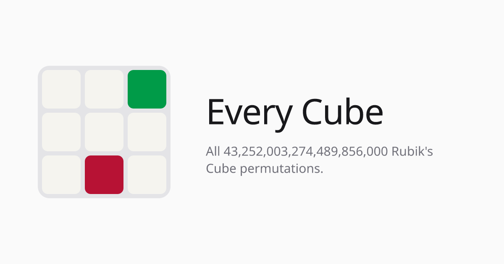

<p align="center">
  
</p>

# Every Cube

A scrollable index of every reachable Rubik's Cube permutation
(43,252,003,274,489,856,000 of them), rendered as a live 3D cube that
mutates as you scroll. There is no database. Every state is generated
on the fly from an index `n` via a rank/unrank function over the cube
group.

Scroll (or drag the ruler) and the cube updates in place: #1 is
solved, the first few thousand states are light scrambles, and the
ruler has markers for a couple of famous patterns (superflip,
checkerboard) so you can jump straight to them.

## Getting started

```bash
npm install
npm run dev
```

Then open http://localhost:3000.

## Scripts

- `npm run dev`: start the dev server
- `npm run build` / `npm run start`: production build and serve
- `npm run test:math`: unit tests for the rank/unrank math core
  (`lib/cubeMath.ts`, `lib/cubeState.ts`, `lib/cubiePlacement.ts`,
  `lib/cubeMoves.ts`, `lib/patterns.ts`)

## How it works

Any permutation index `n` splits into four standard cube coordinates
(corner and edge permutation, corner and edge orientation), ordered so
low indices change orientation only. The cube starts solved and
lightly scrambles before permutations kick in. See `lib/cubeMath.ts`
for the math and `lib/cubiePlacement.ts` for how it turns into
per-piece 3D transforms that pieces can physically animate between.

Famous patterns on the ruler (`lib/patterns.ts`) are not hardcoded
guesses. Superflip is built from its textbook definition and
cross-checked with a round-trip through the ranking pipeline.
Checkerboard is produced with a small, from-scratch move engine
(`lib/cubeMoves.ts`) and verified against the pattern's actual visual
property (each face alternates two colors) before it is allowed to
ship. Both checks run at module load, so a wrong pattern can never
appear silently.

## Tech

Next.js (App Router), TypeScript, Tailwind, and
[react-three-fiber](https://github.com/pmndrs/react-three-fiber) for
the 3D view. No backend and no database, so it deploys as a static
Next.js app.
